# DeOldify

Simply put, the mission of this project is to colorize and restore old images.  I'll get into the details in a bit, but first let's get to the pictures!  BTW – most of these source images originally came from the r/TheWayWeWere subreddit, so credit to them for finding such great photos.

#### Some of many results- These are pretty typical!

Maria Anderson as the Fairy Fleur de farine and Lyubov Rabtsova as her page in the ballet “Sleeping Beauty” at the Imperial Theater, St. Petersburg, Russia, 1890.
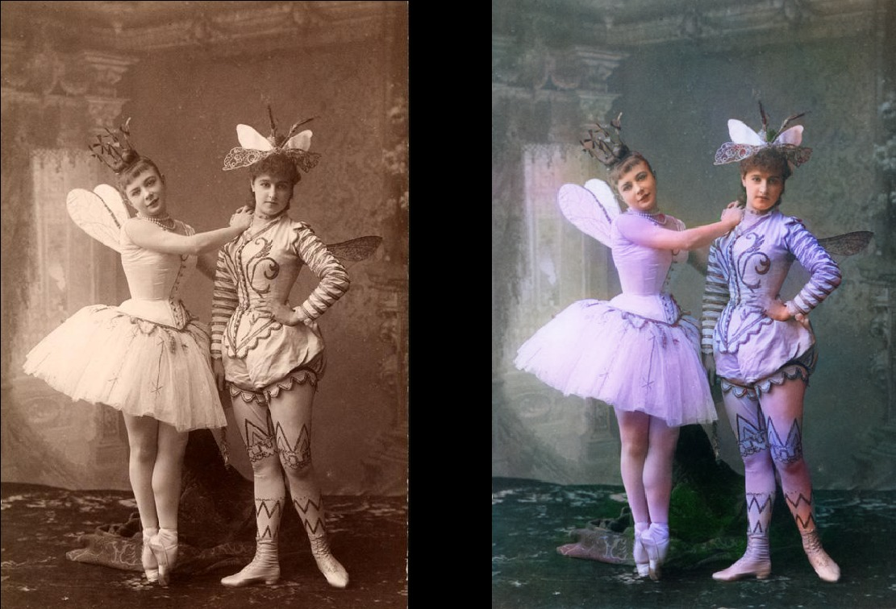

Woman relaxing in her livingroom (1920, Sweden)
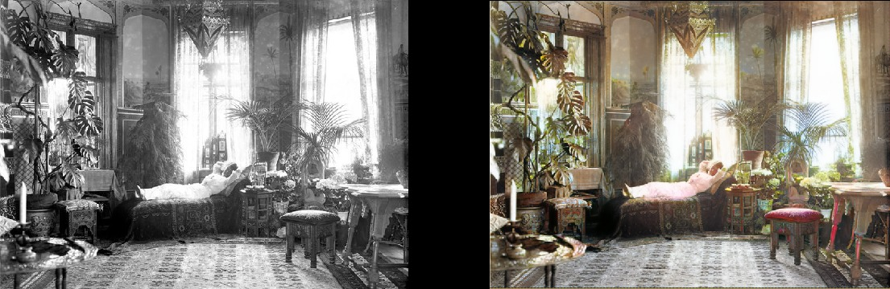

Medical Students pose with a cadaver around 1890
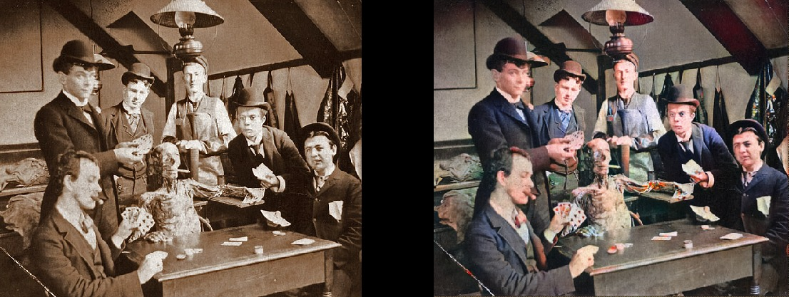

Surfer in Hawaii, 1890
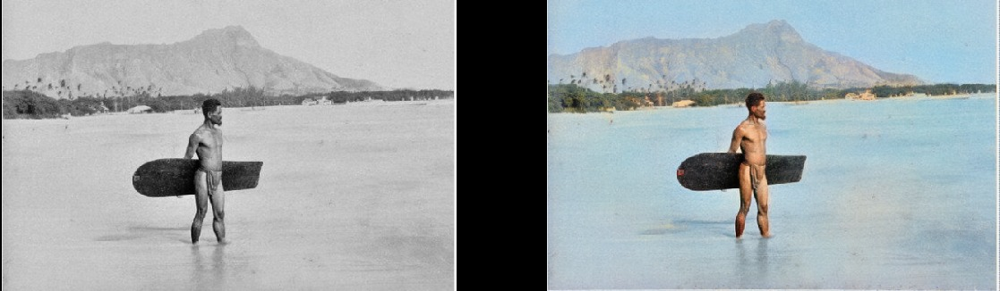

Whirling Horse, 1898
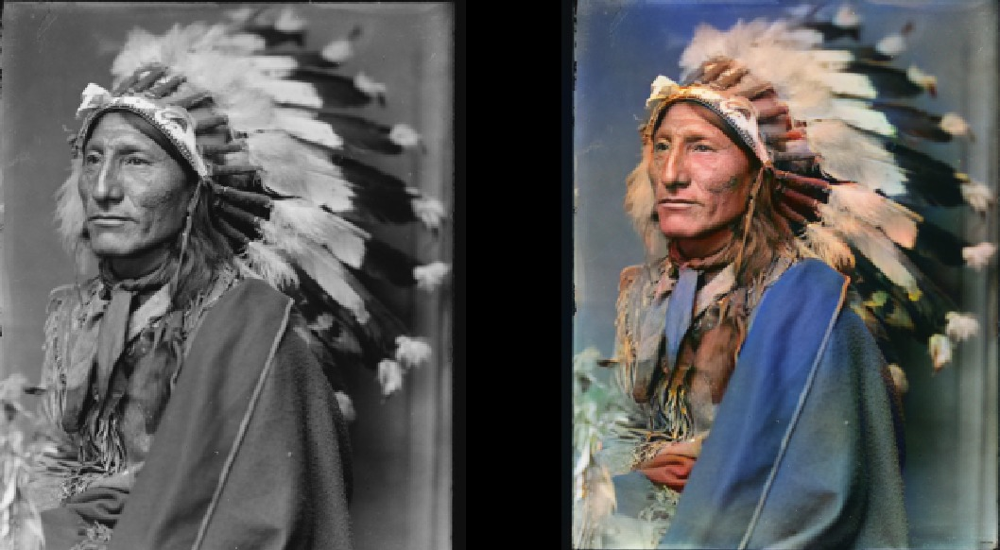

Interior of Miller and Shoemaker Soda Fountain, 1899
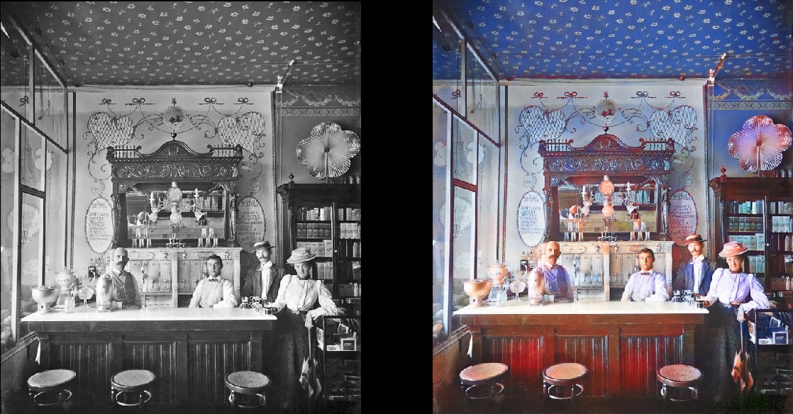

Paris in the 1880s
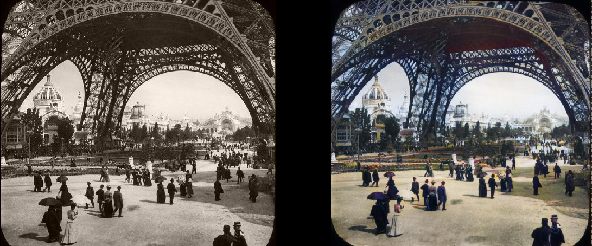

Edinburgh from the sky in the 1920s
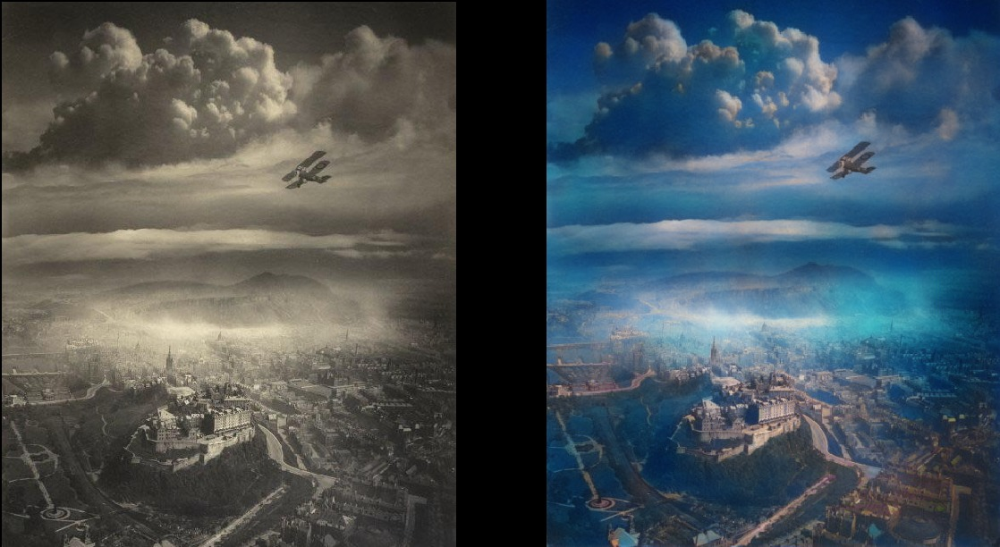

Texas Woman in 1938
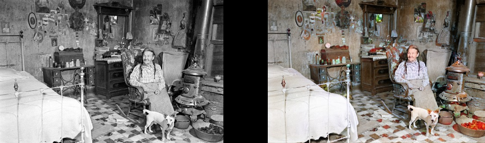

People watching a television set for the first time at Waterloo station, London, 1936
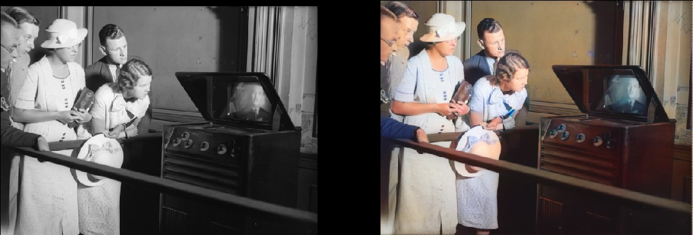

Geography Lessons in 1850
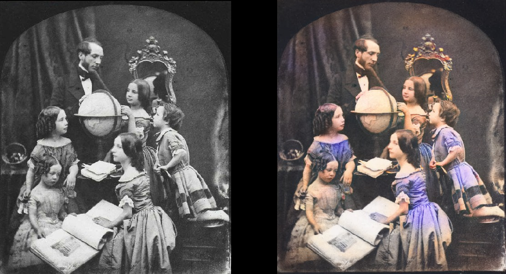

Chinese Opium Smokers in 1880
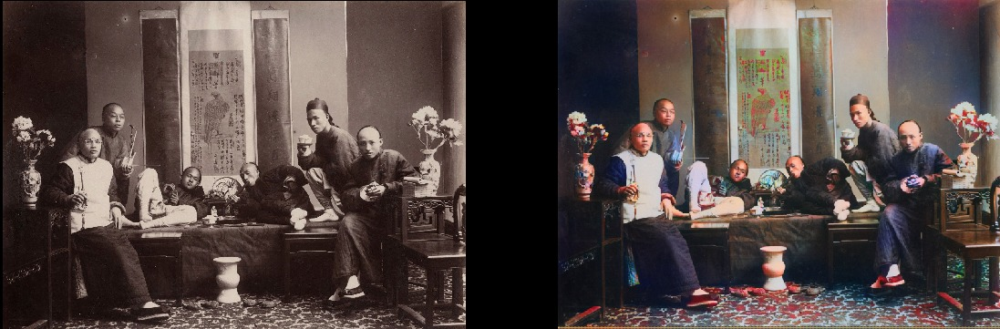

#### Note that even really old and/or poor quality photos will still turn out looking pretty cool:

Deadwood, South Dakota, 1877
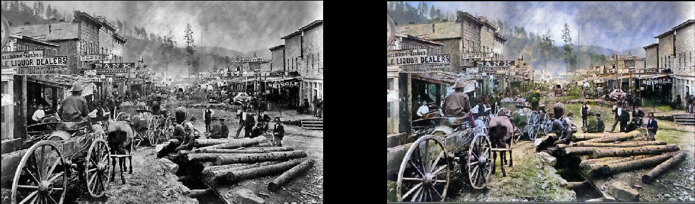

Siblings in 1877
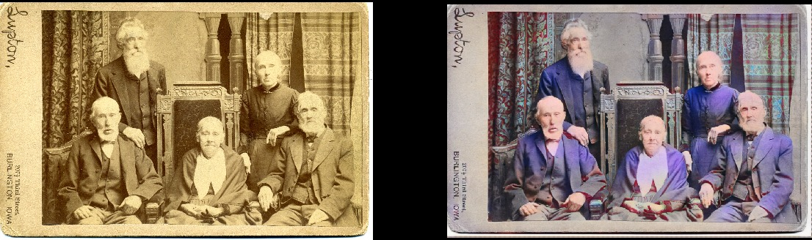

Portsmouth Square in San Franscisco, 1851
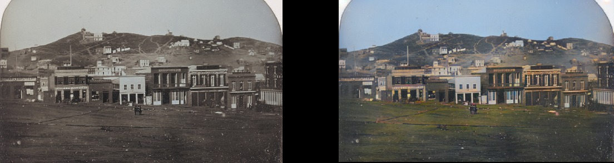

Samurais, circa 1860s
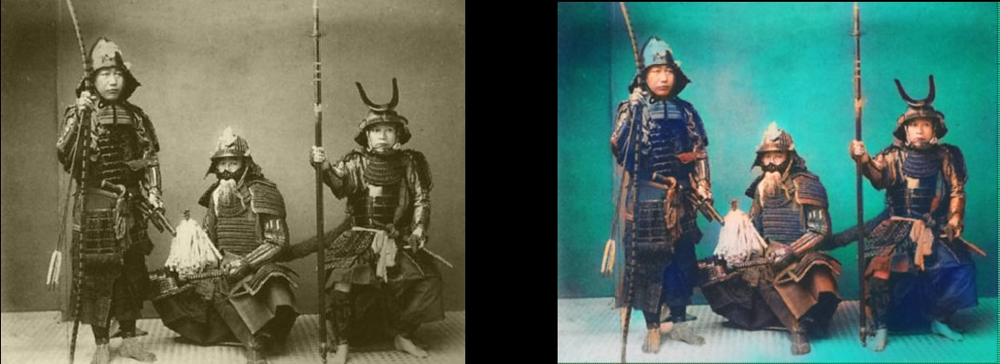

#### Granted, the model isn't always perfect.  This one's red hand drives me nuts because it's otherwise fantastic:

Seneca Native in 1908
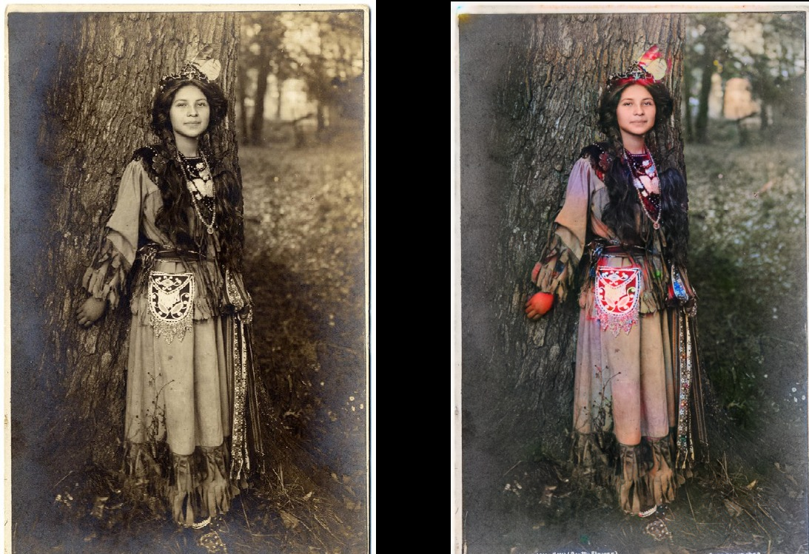

#### It can also colorize b&w line drawings:

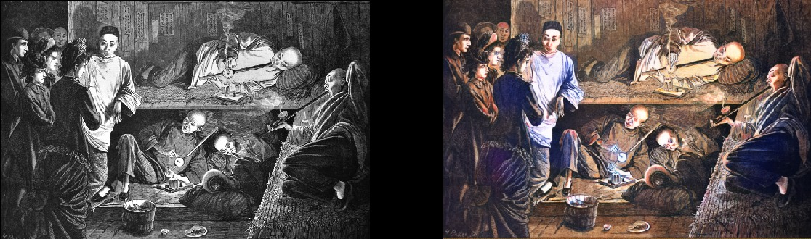

### The Technical Details

This is a deep learning based model.  More specifically, what I've done is combined the following approaches:
* **Self-Attention Generative Adversarial Network** (https://arxiv.org/abs/1805.08318).  Except the generator is a **pretrained Unet**, and I've just modified it to have the spectral normalization and self-attention.  It's a pretty straightforward translation. I'll tell you what though – it made all the difference when I switched to this after trying desperately to get a Wasserstein GAN version to work.  I liked the theory of Wasserstein GANs but it just didn't pan out in practice.  But I'm in *love* with Self-Attention GANs.
* Training structure inspired by (but not the same as) **Progressive Growing of GANs** (https://arxiv.org/abs/1710.10196).  The difference here is the number of layers remains constant – I just changed the size of the input progressively and adjusted learning rates to make sure that the transitions between sizes happened successfully.  It seems to have the same basic end result – training is faster, more stable, and generalizes better.  
* **Two Time-Scale Update Rule** (https://arxiv.org/abs/1706.08500).  This is also very straightforward – it's just one to one generator/critic iterations and higher critic learning rate. 
* **Generator Loss** is two parts:  One is a basic Perceptual Loss (or Feature Loss) based on VGG16 – this just biases the generator model to replicate the input image.  The second is the loss score from the critic.  For the curious – Perceptual Loss isn't sufficient by itself to produce good results.  It tends to just encourage a bunch of brown/green/blue – you know, cheating to the test, basically, which neural networks are really good at doing!  Key thing to realize here is that GANs essentially are learning the loss function for you – which is really one big step closer to toward the ideal that we're shooting for in machine learning.  And of course you generally get much better results when you get the machine to learn something you were previously hand coding.  That's certainly the case here.

The beauty of this model is that it should be generally useful for all sorts of image modification, and it should do it quite well.  What you're seeing above are the results of the colorization model, but that's just one component in a pipeline that I'm looking to develop here with the exact same model. 

What I develop next with this model will be based on trying to solve the problem of making these old images look great, so the next item on the agenda for me is the "defade" model.  I've committed initial efforts on that and it's in the early stages of training as I write this.  Basically it's just training the same model to reconstruct images that augmented with ridiculous contrast/brightness adjustments, as a simulation of fading photos and photos taken with old/bad equipment. I've already seen some promissing results on that as well:

### This Project, Going Forward
So that's the gist of this project – I'm looking to make old photos look reeeeaaally good with GANs, and more importantly, make the project *useful*.  And yes, I'm definitely interested in doing video, but first I need to sort out how to get this model under control with memory (it's a beast).  It'd be nice if the models didn't take two to three days to train on a 1080TI as well (typical of GANs, unfortunately). In the meantime though this is going to be my baby and I'll be actively updating and improving the code over the foreseable future.  I'll try to make this as user-friendly as possible, but I'm sure there's going to be hiccups along the way.  

Oh and I swear I'll document the code properly...eventually.  Admittedly I'm *one of those* people who believes in "self documenting code" (LOL).

### Getting Started Yourself
This project is built around the wonderful Fast.AI library.  Unfortunately, it's the -old- version and I have yet to upgrade it to the new version.  (That's definitely on the agenda.)  So prereqs, in summary:
* ***Old* Fast.AI library**  After being buried in this project for two months I'm a bit lost as to what happened to the old Fast.AI library because the one marked "old" doesn't really look like the one I have.  This all changed in the past two months or so.  So if all else fails you should be able to use the one I forked here: https://github.com/jantic/fastai .  Again, getting upgraded to the latest Fast.AI is on the agenda fo sho, and I apologize in advance.
* **Whatever dependencies Fast.AI has** – there's already convenient requirements.txt and environment.yml there.
* **Pytorch 0.4.1** (needs spectral_norm, so  latest stable release is needed).
* **Jupyter Lab**
* **Tensorboard** (i.e. install Tensorflow) and **TensorboardX** (https://github.com/lanpa/tensorboardX).  I guess you don't *have* to but man, life is so much better with it.  And I've conveniently provided hooks/callbacks to automatically write all kinds of stuff to tensorboard for you already!  The notebooks have examples of these being instantiated (or commented out since I didn't really need the ones doing histograms of the model weights).  Noteably, progress images will be written to Tensorboard every 200 iterations by default, so you get a constant and convenient look at what the model is doing. 
* **ImageNet** – It proved to be a great dataset for training.  
* **BEEFY Graphics card**.  I'd really like to have more memory than the 11 GB in my GeForce 1080TI (11GB).  You'll have a tough time with less.  The Unet and Critic are ridiculously large but honestly I just kept getting better results the bigger I made them.  

**For those wanting to start transforming their own images right away:** To start right away with your own images without training the model yourself, download the weights here:  https://www.dropbox.com/s/7r2wu0af6okv280/colorize_gen_192.h5 (right click and download from this link). Then open the ColorizationVisualization.ipynb in Jupyter Lab.  Make sure that there's this sort of line in the notebook referencing the weights:

  colorizer_path = Path('/path/to/colorizer_gen_192.h5') 

Then the colorizer model needs to be loaded via this line after netG is initialized:

  load_model(netG, colorizer_path)

Then you'd just drop whatever images in the /test_images/ folder you want to run this against and you can visualize the results inside the notebook with lines like this:

vis.plot_transformed_image("test_images/derp.jpg", netG, md.val_ds, tfms=x_tfms, sz=500)

I'd keep the size around 500px, give or take, given you're running this on a gpu with plenty of memory (11 GB GeForce 1080Ti, for example).  If you have less than that, you'll have to go smaller or try running it on CPU.  I actually tried the latter but for some reason it was -really- absurdly slow and I didn't take the time to investigate why that was other than to find out that the Pytorch people were recommending building from source to get a big performance boost.  Yeah...I didn't want to bother at that point.

### Additional Things to Know

Visualizations of generated images as training progresses -can- be done in Jupyter as well – it's just a simple boolean flag here when you instantiate this visualization hook:  GANVisualizationHook(TENSORBOARD_PATH, trainer, 'trainer', jupyter=True, visual_iters=100)

I prefer keeping this false and just using Tensorboard though.  Trust me – you'll want it. Plus if you leave it running too long Jupyter will eat up a lot of memory with said images.

Model weight saves are also done automatically during the training runs by the GANTrainer – defaulting to saving every 1000 iterations (it's an expensive operation).  They're stored in the root training folder you provide, and the name goes by the save_base_name you provide to the training schedule.  Weights are saved for each training size separately.

I'd recommend navigating the code top down – the Jupyter notebooks are the place to start.  I treat them just as a convenient interface to prototype and visualize – everything else goes into .py files (and therefore a proper IDE) as soon as I can find a place for them.  I already have visualization examples conveniently included – just open the xVisualization notebooks to run these – they point to test images already included in the project so you can start right away (in test_images). 

The "GAN Schedules" you'll see in the notebooks are probably the ugliest looking thing I've put in the code, but they're just my version of implementing progressive GAN training, suited to a Unet generator.  That's all that's going on there really.

Pretrained weights for the colorizer generator again are here:  https://www.dropbox.com/s/7r2wu0af6okv280/colorize_gen_192.h5 (right click and download from this link). The DeFade stuff is still a work in progress so I'll try to get good weights for those up in a few days.

Generally with training, you'll start seeing good results when you get midway through size 192px (assuming you're following the progressive training examples I laid out in the notebooks).  

I'm sure I screwed up something putting this up, so please let me know if that's the case. 

### Known Issues

* You'll have to **play around with the size of the image** a bit to get the best result output.  The model clearly has some dependence on aspect ratio/size when generating images. It used to be much worse but the situation improved greatly with lighting/contrast augmentation and introducing progressive training.  I'd like to eliminate this issue entirely and will obsess about it but in the meantime – don't despair if the image looks over-saturated or has weird glitches at the first go. There's a good chance that it'll look right with a slightly different size.  Generally, over-saturated means go bigger.
* To expand on the above- Getting the best images really boils down to the **art of selection**.  Yes, results are cherry picked.  I'm very happy with the quality of the outputs and there's a pretty good amount of consistency, but it's not perfect.  This is still an ongoing project!  I'd consider this tool at this point fit for the "AI artist" but not something I'd deploy as a general purpose tool for all consumers.  It's just not there yet.
* To complicate matters – this model is a **memory hog** currently, so on my 1080TI I can only do 500-600px max on the sz parameter for the images.  I'm betting there's plenty of low-hanging fruit to get some wins on this but I just haven't done it yet.
* I added zero padding in the Unet generator for whenever the pretrained resnet winds up passing up a tensor that doesn't match expected dimensions (namely so I could throw any arbitrarily-sized image at it).  This was a super-quick hack and it results in **stupid right and bottom borders on the outputs** for those arbitarily-sized test images. I'm sure there's a better way, but I  haven't gotten around to addressing it yet.  
* The model *loves* blue clothing.  Not quite sure what the answer is yet, but I'll be on the lookout for a solution!

### Want More?

I'll be posting more results here on Twitter: https://twitter.com/citnaj

### UPDATE 11/6/2018
Wow this project blew up in popularity way more than I expected, in just a few days.  As you might have gathered from the state of the project- I don't know what the hell I'm doing with managing a large GitHub project with lots of people.  Never expected that I'd need to.  So I'll be trying to get things caught up over the next few days with things like requirements.txt, documentation, not storing large files in your git history, etc.  The whole point is to make this useful, after all, right?

