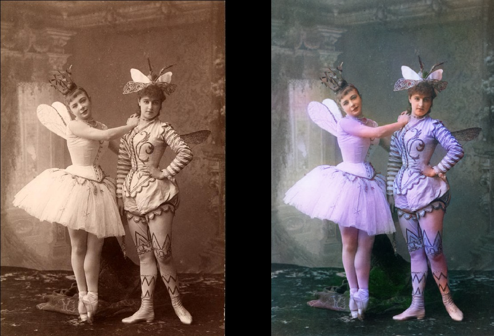
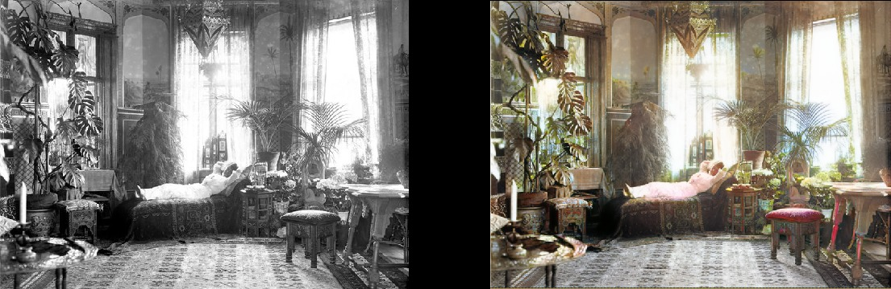
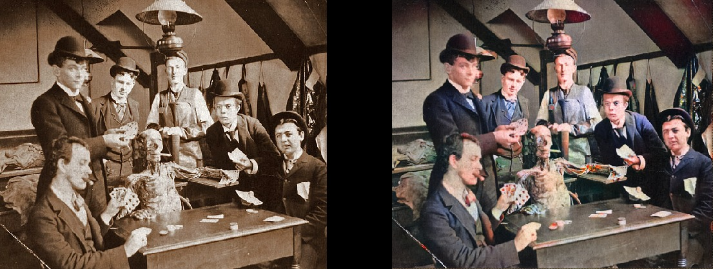
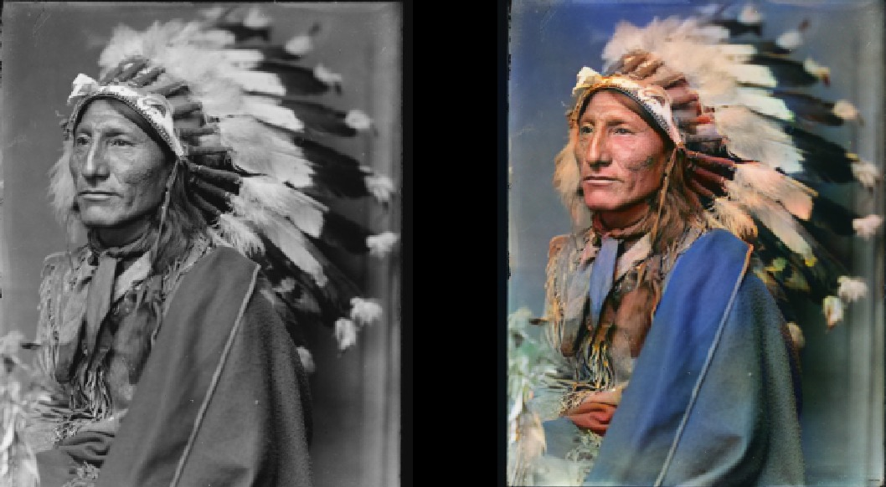
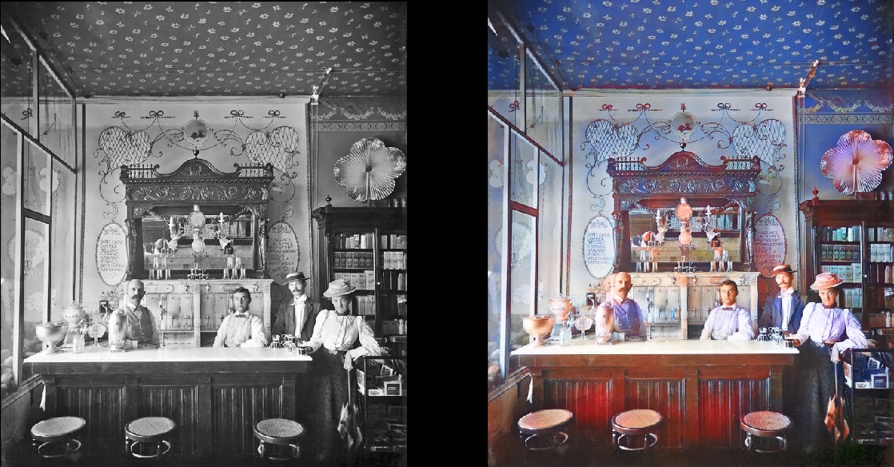
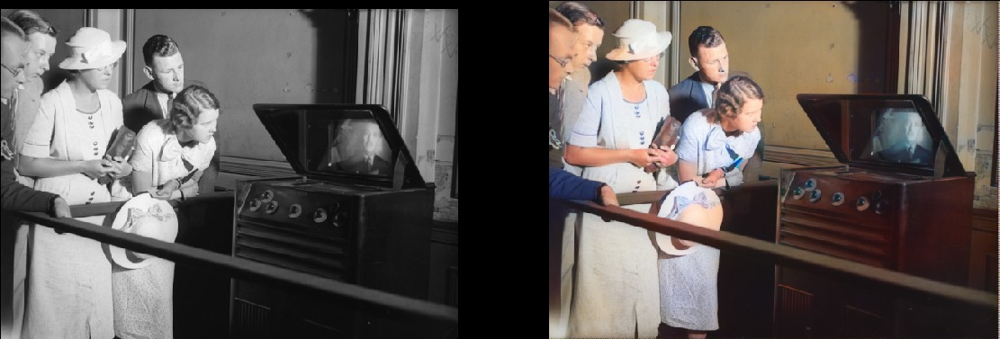
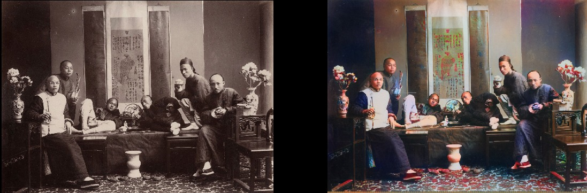
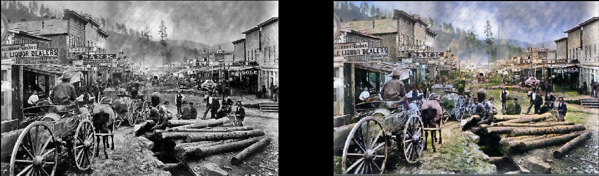
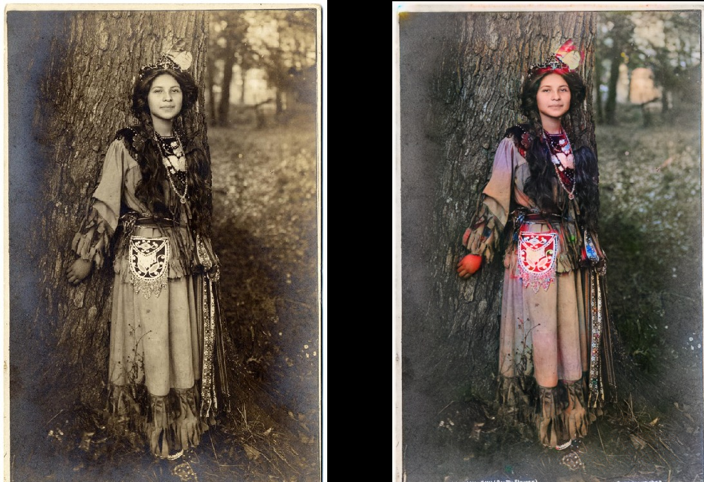
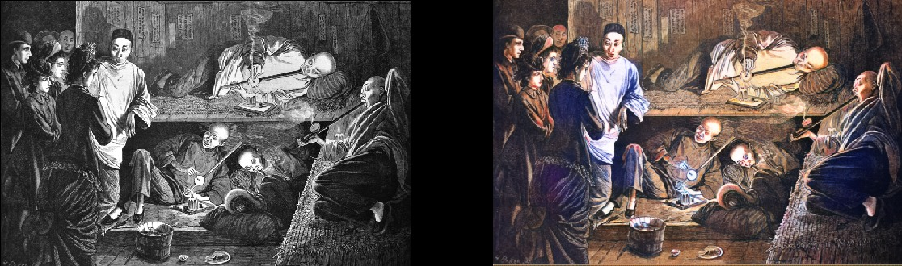

# DeOldify

Simply put, the mission of this project is to colorize and restore old images.  I'll get into the details later, but let's get to the pictures first!  BTW- most of these source images originally came from TheWayWeWere subreddit at Reddit, so credit to them for finding such great photos.

#### Some of many results- These are pretty typical results!

Maria Anderson as the Fairy Fleur de farine and Lyubov Rabtsova as her page in the ballet “Sleeping Beauty” at the Imperial Theater, St. Petersburg, Russia, 1890.

Woman relaxing in her livingroom (1920, Sweden)

Medical Students pose with a cadaver around 1890

Surfer in 1890, Hawaii

Whirling Horse, 1898

Interior of Miller and Shoemaker Soda Fountain, 1899

Paris in the 1880s

Edinburgh from the sky in the 1920s

Texas Woman in 1938

People watching a television set for the first time at Waterloo station, London, 1936

Geography Lessons in 1850

Chinese Opium Smokers in 1880

#### Note that even really poor quality and/or old photos will still turn out looking pretty cool:

Deadwood, South Dakota, 1877

Siblings in 1877

Portsmouth Square in San Franscisco, 1851

Samurais Circa 1860s

#### Granted, the model isn't always perfect.  This one's red hand drives me nuts because it's otherwise fantastic:

Seneca Native in 1908

#### It can also colorize drawings:

### The Technical Details

